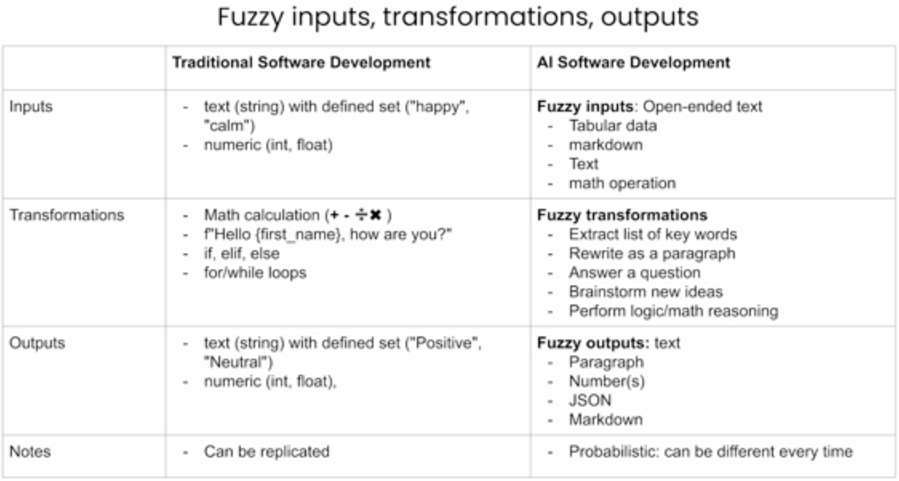
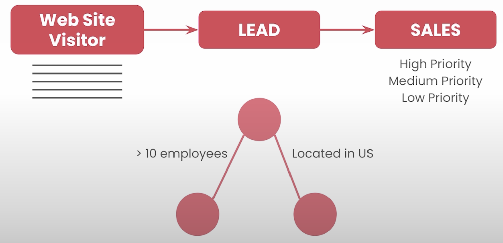
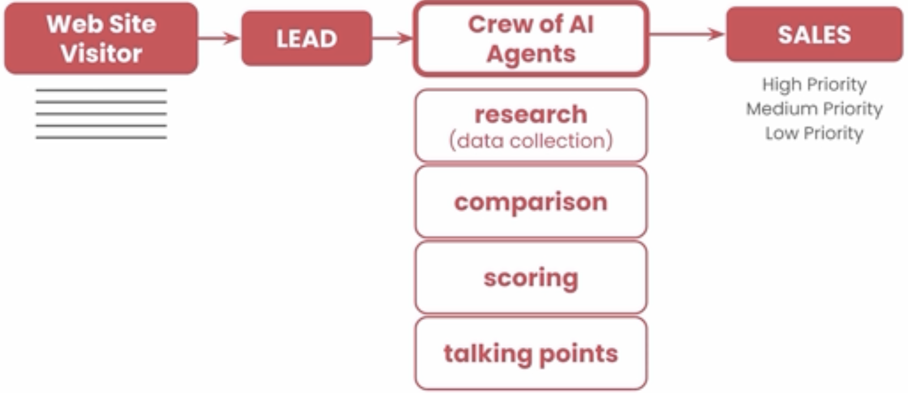
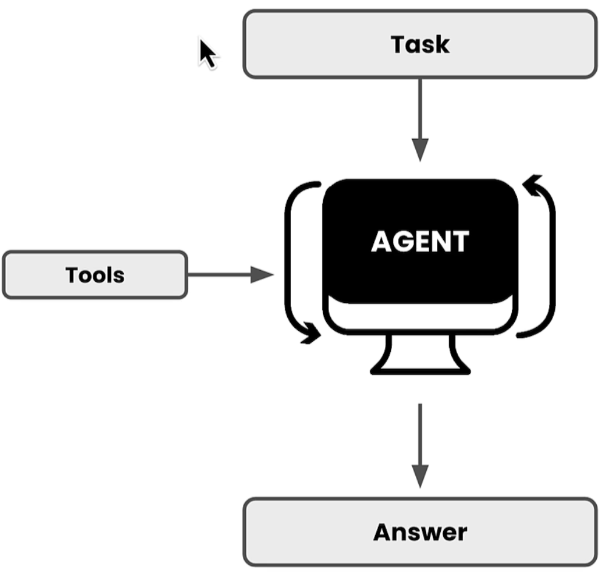
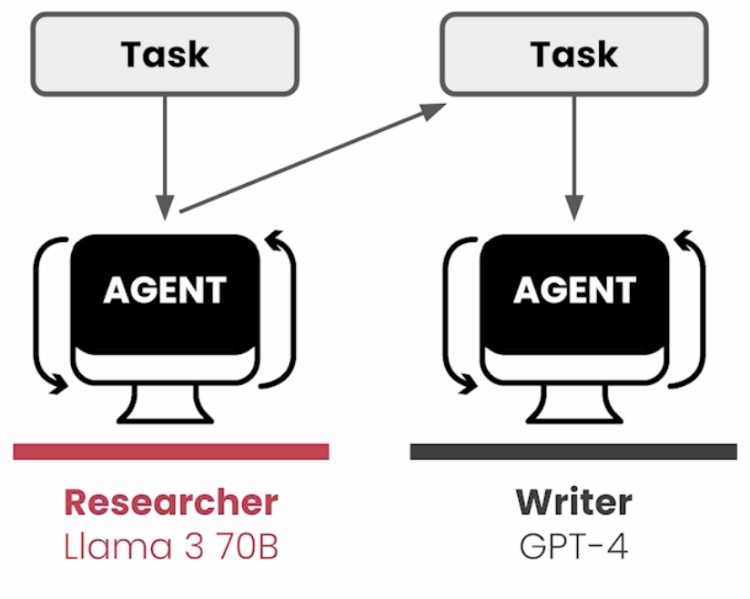

# 1. Introduction
## 1.1 Agentic Automation

- LLMs are a better choice for solving probabilistic problem sets e.g. generating a resume given a job description

- Traditional Software Development is still a better choice for deterministic problem sets.

### 1.1.1 Case Study: Enhancing Lead Generation

- Traditional Lead Generation involves a visitor filling out a form.
- Once the form is submitted a lead is created on a CRM.
- A CRM performs analysis to assign priority to the lead.

Agentic Automation can enhance this process:

## 1.2 LLM Agents

An LLM Agent is a system that uses a large language model not just for generating text, but as a decision-making component 
Agents interact with external tools, data, environments, or APIs to achieve a goal.

## 1.3 Multi LLM Agents

A Multi-LLM Agent is a system where multiple agents interact with each other, often with specialised roles, to collaboratively perform complex tasks that exceed the capabilities of a single agent.
