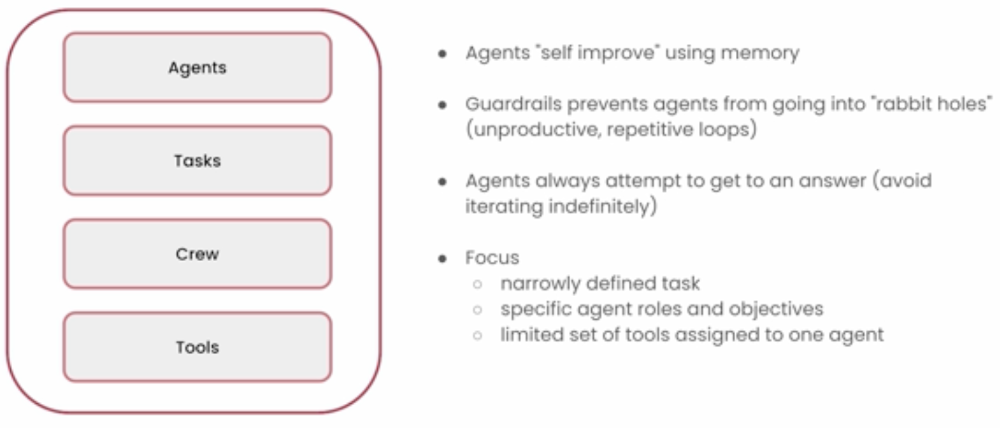

# 3. Key Elements of AI Agents

## 3.1 Role Playing

- Specifying the role you wish the LLM to play e.g. Senior Python Engineer, sets a context for the LLM resulting in an output closer to your expectation.

For example:
- Asking an LLM to generate python code would output something to get a task done.
- Asking an LLM to assume the role of a senior Python Engineer, would implicitly add requirements of employing industry-standard coding practices and optimisations.

Another example:

## 3.2 Focus

- LLM Agents have a context window that allows them to keep track of the task at hand.
- Assigning an agent with too many tasks, overwhelming the agent with too much information, or giving the agent too many tools all take up a lot of space.
- To make space for this extra information, some context drops out of the window causing hallucinations to be more likely.

- **It is therefore recommended to use multiple agents that focus on small specialised tasks**.
- _Apparently, employers are okay to do this with agents but not with human employees_

## 3.3 Tools

- **Provide agents with tools that they actually need to get the job done, and provide the smallest subset of tools possible.**

- Providing unnecessary tools can confuse the agents i.e. An LLM agent is not smart enough to assess if it needs to use a tool or not. Nor can an LLM assess the quality of the tool; if it's there it will try to use it. 
- A LLM might decide to use an uneffective tool and consequently produce poor output.

## 3.4 Cooperation

- **Allow LLM Agents to collaborate with other agents. Synergy allows each agent to work on its specialisation while still delivering a quality overall output**

## 3.5 Guardrails

- Guardrails ensure that the agent remains focused on the task at hand.
- For example, Guard rails prevent:
    - LLM from taking too long to answer
    - Stuck in a loop
    - Using the same tools repeatedly, rather than assessing different tools 
- Guardrails are necessary for reliable and consistent resuls.

## 3.6 Memory

- Memory is the most important element: the ability to learn from experience.
- `crew.ai` provides 3 types of memory:
    - **Short Term Memory**: 
        - Memory during execution of a task. Shared by all agents in the crew.
    - **Long Term Memory**: 
        - Memory that persists after the execution of a task and can be used for future tasks.
        - Leads to 'self-improving' agents.
    - **Entity Memory**
        - Memory of entities learnt from tasks e.g. people, organisation, companies

## 3.7 Summary

---

## Mental Model for Agent Creation

- When designing a LLM Crew you, as the developer, should take on the role of the manager.
- A manaager needs to answer 2 questions:

    1. What is the goal
    2. What is the process to achieve the goal.

- With these 2 questions in mind, we can identify what roles and collaboration we need to achieve the goal.