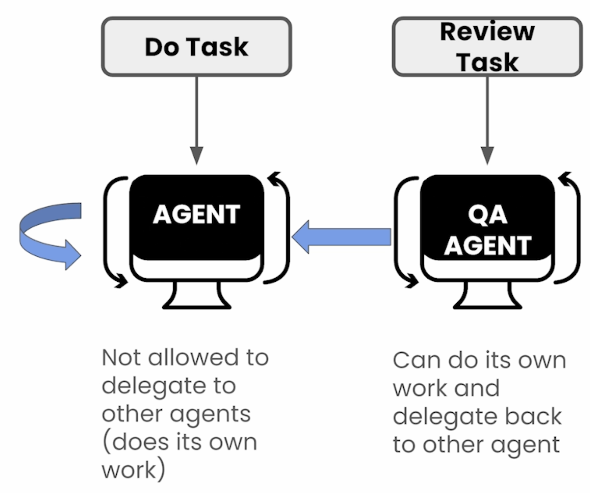

# Delegation

- In this example, we assigned the QA Agent the task to review the output from the Support Agent and decide if the response meets the stated requirements. If the response does not meet the criteria, the QA agent will delegate the task back to the support agent.

- How the QA Agent assesses the response is fuzzy! The prompt engineer defines the requirements and the QA agent evaluates if the response meets the requirements in the context of the customer's question.

- **The QA Agent pattern is helpful in ensuring reliable answers with reduced chances of hallunications**

# Tools

Tools can be assigned at an **Agent Level** or at a **Task Level**
- **Agent Level**: Tool is always available for the agent to use at its descretion.
- **Task Level**: Tool is to be used only for a certain task.

- **Task Level tools take precedence over Agent Level tools**: If an agent has 10 tools at its disposal, but a task only specifies 1 tool, then the agent will use the 1 task tools.

