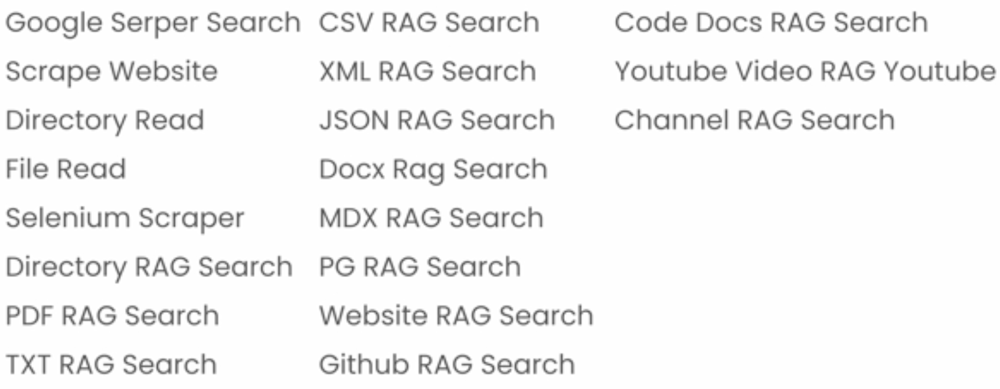
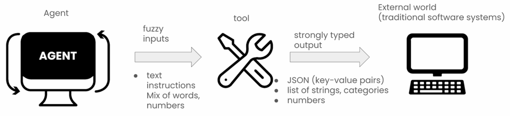
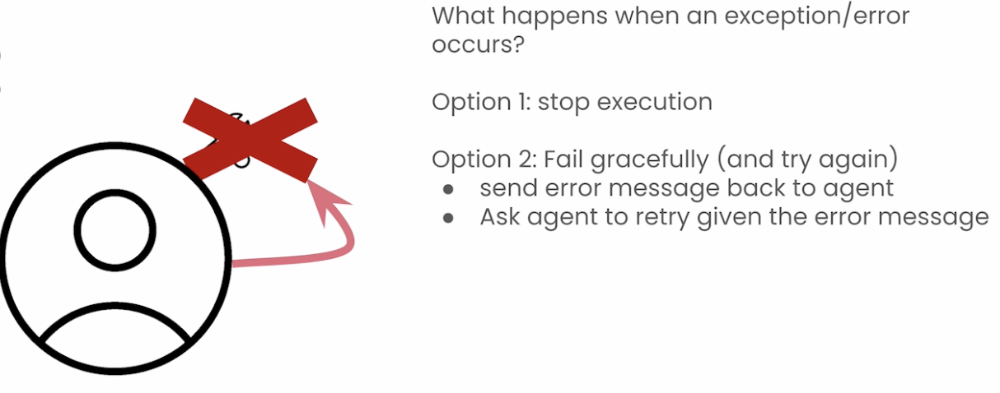
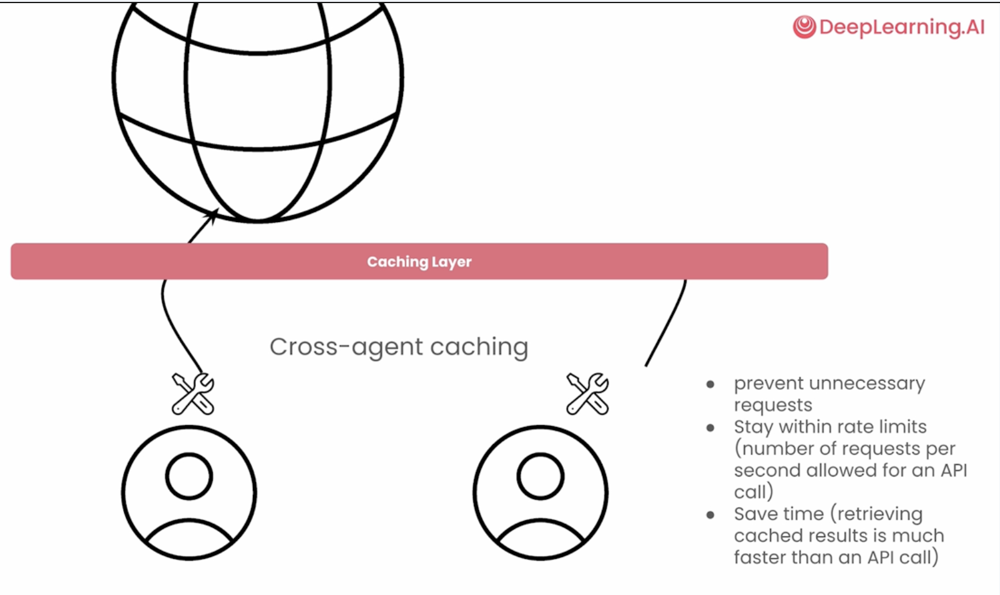

# 5. Tools

## 5.1 Introduction

**Examples**
- Search the internet
- Search a website
- Connect to a database
- Call an API
- Send notification
+ All Langchain tools

 

## 5.2 What makes a great tool

1. **Versatile:** 
    - A tool's job is to converrt the fuzzy input received from the LLM to strong-typed input required by a tool. 
    - For example, to convert the fuzzy input to the JSON payload for an API request.

    

1. **Fault-Tolerant:**
    - A tool should be self-healing.
    - Rather than stopping execution on an exception, it should be able to communicate information back to the LLM agent to take suitable action e.g

    

1. **Caching:**

    - Caching layer to prevent unnecessary requests.
    - Crew.ai offers cross-agent caching i.e. if one agent (say a Researcher) uses a tool with a set of arguments, and another agent (say a Research Evaulator) uses the same tool with the same arguments, then the tool will execute once and the second agent will receive a cached response.

    