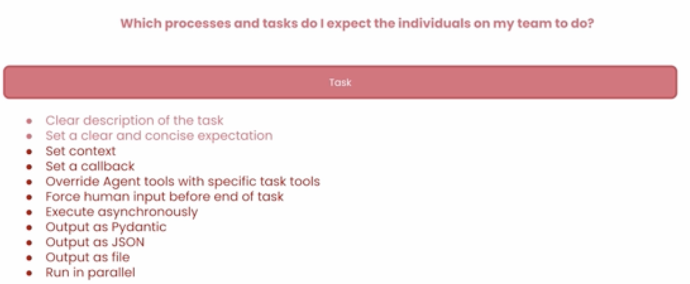

# 7. Tasks Best Practices

## 7.1 Introduction

- As mentioned when talking about crews, when assigning tasks, you, as the developer, should take on the role of the manager delegating tasks to a junior role.
- When defining the job, be clear on:

    - **Expected Process to follow**: Clear description the task
    - **Expected Outcome**: Set a clear and concise expectation

- Other options to consider when defining a task:

