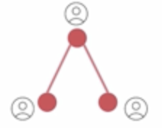

# 9. Multi-Agent Collaboration

## 9.1 Sequential Processes

- So far we've seen sequential processes where the output of one agent is passed to the next.

- The drawback of this approach is that the context slowly fades as the number of agents in the chain grows, like a game of Chinese Whispers.

- Therefore, we can look at other approaches of agent collaboration

## 9.2 Hierarchial

- In a hierarchial arrangement, a manager delegates tasks to line-level agents. 

- Each time a line-level agent completes a task, the manager reviews it in the context of the end goal before performing the next task.

- This process is repeated until all tasks are executed.

- Multiple hiearchial arrangements can work in parallel:

